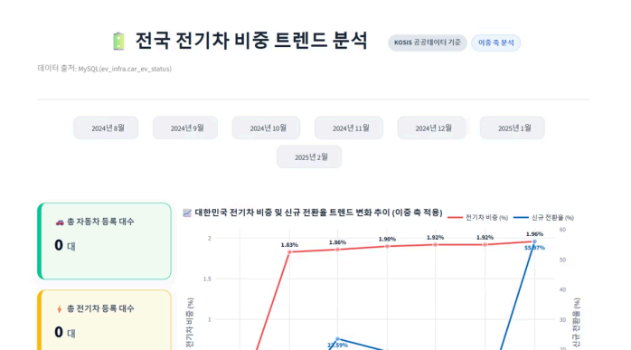
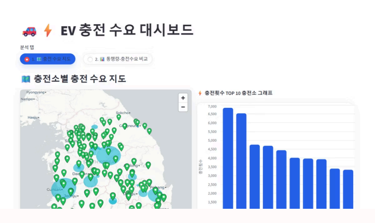
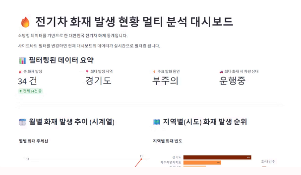
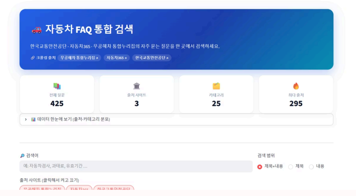

# ⚡ EV — 전기차 공공데이터 조회 웹 애플리케이션

> 수업에서 배운 개별 기술을 연계하여 데이터를 직접 수집·적재하고, Streamlit으로 시각화까지 수행한 프로젝트입니다.

<br>

## 1. 팀 소개

**팀명 : 클로드야 해조**

🔗 **프로젝트 저장소** : [skn_1st_project_evcar](https://github.com/skn1stevcar/skn_1st_project_evcar)

| 이름 | 역할 | 담당 데이터셋 | GitHub |
| :---: | :---: | :--- | :--- |
| 안정민 | **PM** | 자동차 FAQ (3개 사이트 크롤링) | [@AhnJung-min](https://github.com/AhnJung-min) |
| 권세진 | 팀원 | 고속도로 통행량 · 충전 수요 | [@tangerine0101](https://github.com/tangerine0101) |
| 김길환 | 팀원 | 전체 자동차 대비 전기차 비중 | [@amygdalis24](https://github.com/amygdalis24) |
| 신가을 | 팀원 | 전기차 화재 발생 현황 | [@SpicyAutumn](https://github.com/SpicyAutumn) |
| 김혜리 | 팀원 | 고속도로 충전 수요 · 지도 시각화 | [@kimerry-333](https://github.com/kimerry-333) |

<br>

## 2. 프로젝트 개요

- **프로젝트 명** : EV
- **프로젝트 소개** : 수업에서 배운 개별 기술을 연계하여 직접 데이터를 수집하고 DB에 적재한 후, Streamlit을 이용하여 시각화까지 진행한 프로젝트입니다.
- **프로젝트 필요성 (배경)** : 전기차를 구매하는 사람들이 많아지고 있기에, 충전소 인프라가 어디에 얼마나 구성되어 있는지, 그리고 전기차에서 발생하는 사고의 종류는 어떤 것이 많은지를 미리 알 수 있도록 하기 위해 진행하였습니다.
- **프로젝트 목표** : 전기차 관련 공공 데이터를 조회할 수 있는 웹 애플리케이션을 구현합니다.

### 🛠 사용 기술

| 구분 | 기술 |
| :---: | :--- |
| 언어 |  |
| 데이터 수집 | `requests` (OpenAPI) · 웹 스크래핑 ·  주소검색 API (좌표 변환) |
| 데이터 처리 |  · `openpyxl` |
| 데이터베이스 |  ·  · `PyMySQL` |
| 시각화 / 웹 |  ·  · `Altair` · `pydeck` |
| 환경 관리 |  `.env` 기반 DB·API 키 분리 |

<br>

## 3. 데이터 수집 방법

공공데이터 포털 OpenAPI/파일과 웹 스크래핑을 함께 사용했으며, 수집한 원본은 정제(transform) 후 MySQL `ev_infra` DB에 적재했습니다.

| 데이터셋 | 출처 | 수집 방식 | 적재 테이블 |
| :--- | :--- | :--- | :--- |
| 자동차 FAQ (425건) | 한국교통안전공단 · 자동차365 · 무공해차 통합누리집 | 웹 스크래핑 | `faq` |
| 전기차 화재 발생 현황 | 소방청 | 공공데이터 파일(CSV) | `ev_fire_records` |
| 지역별 전기차 / 전체 자동차 현황 | 한국전력공사 · 국토교통부 | 공공데이터 파일(CSV) | `car_ev_status` |
| 고속도로 통행량 · 충전 수요 | 한국도로공사 등 | 공공데이터 파일(XLSX) | `ev_traffic_analysis` · `ev_charging_analysis` |
| 충전소 좌표 | Kakao 주소검색 API | 주소 → 위경도 변환 | `ev_charger_geo` |

> FAQ 출처별 수집 건수 — 한국교통안전공단 295건 · 자동차365 93건 · 무공해차 통합누리집 37건 = **합계 425건**
>
> 자세한 데이터셋 명세(컬럼·인코딩·연계 가이드)는 [`DATASETS.md`](DATASETS.md) 참고.

<br>

## 4. DB 설계 (논리 / 물리 ERD)

전체 스키마는 [`sql/schema.sql`](sql/schema.sql)에 정의되어 있으며, `ev_infra` 데이터베이스(utf8mb4)에 아래 테이블로 구성됩니다.

| 테이블 | 설명 | 담당 |
| :--- | :--- | :---: |
| `faq` | 자동차 관련 사이트 FAQ(출처별 통합, PK: `source` + `id`) | 안&#8288;정&#8288;민 |
| `ev_fire_records` | 전기차 화재 발생 현황(연·월·시도·발화요인 등) | 신&#8288;가&#8288;을 |
| `car_ev_status` | 전체 자동차 대비 전기차 비중(지역·월별) | 김&#8288;길&#8288;환 |
| `raw_highway_traffic` / `ev_traffic_analysis` | 고속도로 통행량 원본 → 정제·집계 | 권&#8288;세&#8288;진 |
| `ev_charger_geo` | 충전소 좌표(Kakao API 결과) | 권&#8288;세&#8288;진 |
| `raw_ev_charger_daily` / `ev_charging_analysis` | 충전소 일별 원본 → 정제·집계 | 김&#8288;혜&#8288;리 |
| `ev_charging_map_analysis` (VIEW) | 충전 집계 + 좌표 조인(지도 시각화용) | 김&#8288;혜&#8288;리 |

> 설계 패턴 — 원본은 `raw_*` 테이블에 문자 그대로 적재한 뒤, SQL/Python으로 정제해 `*_analysis` 분석 테이블로 빌드합니다. 지도 화면은 별도 적재 없이 VIEW로 조인합니다.

<!-- 논리 ERD 이미지 (작성 예정) -->
<!-- 물리 ERD 이미지 (작성 예정) -->

<br>

## 5. 주요 기능

> 메인 페이지([`app/dashboard.py`](app/dashboard.py))는 4개 분석 페이지로 진입하는 랜딩 페이지이며, 사이드바에서 아래 순서로 이동합니다.

### 5-1. 전기차 비중 트렌드 `pages/1_EV_Share_Trend · car_ev_status`
- 이중축 라인 차트 — 전기차 비중(%) + 신규 전환율(%) (`make_subplots` + `go.Scatter`)
- 기간 선택 라디오 → 선택 월 강조
- 지표 카드 3종 (총 자동차 / 총 전기차 / 비중, 전월 대비 증감)
- 연월별 상세 표 (`st.dataframe`)
- DB 접속 실패 시 `data/general_num.csv` + `ev_num.csv` 로 자동 폴백

### 5-2. 충전 수요·통행 분석 `pages/2_EV_Charging_Demand · charging/traffic/geo`
탭 4개(`st.radio`)로 구성됩니다.
- **충전 수요 지도** — pydeck 산점 지도(163곳) + 표 + 표시 수 슬라이더
- **통행 vs 충전 비교** — 일별 라인 + 통행×충전 산점도 + 표
- **통행량 분석** — 일별 라인 + 목적지 다중선택 라인 + 목적지/구간 Top10 표
- **충전 상세** — 일별 라인 + 충전건수 Top10 막대 + 충전소 drill-down(선택 → 지표 + 라인)

### 5-3. 전기차 화재 현황 `pages/3_EV_Fire_Incidents · ev_fire_records`
- KPI 지표 4종 (`st.metric`)
- 사이드바 대화형 필터(연도·시도·발화요인) → 전체 대시보드 실시간 필터링
- 월별 화재 발생 추이 — 시계열 라인 (`px.line`)
- 지역(시도)별 화재 순위 — 가로 막대 (`px.bar`)
- 발화요인 대→소분류 계층 분석 — 트리맵형
- 지상/지하 공간별 비율 — 도넛 (`px.pie`)
- 차량 상태별 발화요인 교차 분석 — 누적 막대 (stacked bar)
- 상세 표

### 5-4. FAQ 대시보드 `pages/4_FAQ · faq`
- 출처별 분포 — 도넛 차트 (`px.pie`)
- 카테고리 Top 10 — 가로 막대, 클릭 시 해당 카테고리로 결과 필터 (`px.bar` + `on_select`)
- 출처 사이트 토글 칩 (`st.pills`) / 카테고리 다중선택 필터 (`st.multiselect`)
- 지표 카드 4종 + 질문 검색
- DB 접속 실패 시 `data/faq.json` 으로 자동 폴백

> 모든 페이지는 DB 연결 실패 시 로컬 CSV/JSON으로 폴백하도록 구현해, DB 없이도 화면을 확인할 수 있습니다.

<br>

## 6. 실행 방법

```bash
# 1) 패키지 설치
pip install -r requirements.txt

# 2) 환경변수 설정 — .env.example 을 복사해 DB 비밀번호·Kakao API 키 입력
copy .env.example .env   # Windows
# cp .env.example .env    # Mac/Linux

# 3) (선택) DB 스키마 생성 후 데이터 적재
mysql -u root -p < sql/schema.sql

# 4) 대시보드 실행
streamlit run app/dashboard.py
```

> DB가 없어도 각 페이지가 `data/` 의 CSV/JSON으로 폴백 동작합니다.

### 디렉토리 구조

```
skn_1st_project_evcar/
├── common/                 ← 팀 공용 모듈 (config·db·models·ui)
├── data/                   ← 수집 데이터 (CSV / JSON / XLSX)
├── etl/                    ← 수집(extract)·정제(transform)·적재(load) 스크립트
├── sql/                    ← DB 스키마 및 ERD import SQL
├── app/
│   ├── dashboard.py        ← 메인(랜딩) 페이지
│   └── pages/              ← 1_비중 / 2_충전수요 / 3_화재 / 4_FAQ
├── .env.example            ← 환경변수 템플릿
├── requirements.txt
├── DATASETS.md             ← 데이터셋 상세 명세
└── README.md
```

<br>

## 7. 수행 화면 캡처

### 7-1. 전기차 비중 트렌드
전국 전기차 비중·신규 전환율을 이중축 라인 차트로 분석하는 화면.



### 7-2. 충전 수요 대시보드
pydeck 지도로 충전소별 충전 수요를 보여주고, 충전횟수 Top 10 충전소를 함께 분석하는 화면.



### 7-3. 전기차 화재 발생 현황
소방청 데이터 기반으로 월별 추이·지역별 순위·발화요인을 멀티 분석하는 화면.



### 7-4. 자동차 FAQ 통합 검색
3개 출처(한국교통안전공단·자동차365·무공해차 통합누리집)의 FAQ 425건을 통합 검색하는 화면.



<br>

## 8. 회고

> _작성 예정_

| 이름 | 회고 |
| :---: | :--- |
| 권세진 |  |
| 김길환 |  |
| 신가을 |  |
| 안정민 |  |
| 김혜리 |  |
